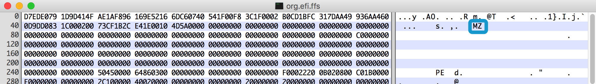
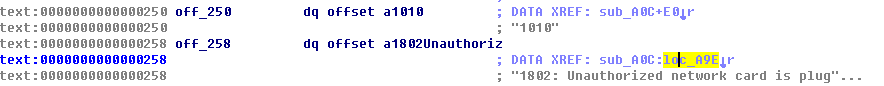

## 以前的方法

### 删除模块或完全跳过模块

ThinkPad *30 这一代的 BIOS 的白名单移除方法在[这里](https://github.com/mytbk/firmware_notes/blob/master/tp-uefi-whitelist-removal.md)。但我试了一下，不管是直接移除 LenovoWmaPolicyDxe 还是修改内容为 `wa ret` 直接结束运行，原机蓝牙都会出现[问题](https://github.com/mytbk/firmware_notes/issues/4)：

> 1. 对于 macOS、配置了 `acpi_osi=! acpi_osi=Linux` 的 Linux 和 Windows 7 及更早的 Windows，只要经过睡眠唤醒流程，蓝牙就会失效，重启才可恢复。唤醒后在 `dmesg` 中可以见到 USB disconnected，这使得蓝牙鼠标和键盘难以使用。
> 2. 对于默认配置的 Linux 和 Windows 8 及更新的 Windows，蓝牙就完全消失了，USB 设备列表里没有蓝牙设备。

（注：我的电脑本来带有蓝牙模块，所以买的网卡就是不带蓝牙的BCM94352HMB（即便上面写着 WiFi + BT Card 甚至还有 BT MAC Address））

### 修改白名单项

所以要根据 BIOS 显示的 VID / PID / SUBSYS 来修改模块中预置的列表。要注意的是 Intel 网卡的 VID 和 SUBSYS 开头都是 8086，不要把 VID + PID 和 SUBSYS 的顺序弄倒了。模块里的顺序与 BIOS 显示是相同的，即 VID / PID / SUBSYS，当然每个 short 的两个字节还是要颠倒的。替换时要注意顺序。如下图所示。

我这里 BIOS 显示的是 14E4/43B1/1A3B/2123. 注意后面 I 卡的坑爹 ID.

## 新的挑战

但是今天给朋友换卡的时候遇到了问题。他的卡上带有蓝牙模块，在 BIOS 里会有两个报错，一个网卡一个蓝牙。按照上面的方法改好以后，网卡报错没了，但蓝牙报错还有（也是奇怪，USB 设备怎么会当做 PCI 设备处理）。问题是蓝牙只有 VID 和 PID，没有 SUBSYS，BIOS 也只显示成 xxxx/xxxx，不知道应该改哪里。挑了个网卡出来，VID 和 PID 改了，SUBSYS 清 0，无效。文件里其他看起来只有 VID 和 PID 的地方查不到对应设备，不敢确定是数组元素，于是不敢动。

既然白名单列表改不了，模块又不能删，就只能看看怎么跳过检查了。此外，能做到即使发现出错也不报警的话，也能解决问题。

### 分析一下

好在这个文件只有 7KB 大，还有一堆数组内容，看起来应该不会很麻烦吧。

直接丢进 IDA，发现类型识别为 Binary？

这种情况下反汇编显然不行。突然注意到……

这看起来就是 PE 格式文件头的标志诶…… 想起 UEFITool 里一个模块确实是由 PE32 Image 三个部分组成的，那应该确实是这样的了。

去除 `MZ` 之前的部分，IDA 果然识别了

好了这就容易看了。我的思路是先去找到报错提示在哪里，然后看看哪个函数会调用它报告错误，就可以想办法跳过了。

这个很好找，前后翻翻就知道了。跟着 XREF 可以到调用的函数里面

在 `loc_A9E` 上面还可以看到 VID / PID [/ SUBSYS] 的打印流程。可以看到打印 ID 以后都会到 `loc_A9E` 来，说明这几个 location 都是错误路径。再从选择打印 ID 数量的分支处（0xA4D）往上看，0xA3D 处还有个跳转，到 `loc_B0F` 。B0F 这里没什么操作就 return 了。

看起来这是正确路径，虽然不知道这是在干嘛（当然也不知道错误路径最后跳哪去了）。

那么猜一下，在 `jl loc_B0F` 那里不进行 less than 判断而强制跳转，应该没问题了吧？

Hex View 中 0xA3D 这条指令对应的 opcode 是

` 0F 8C CC 00 00 00`

可以谷歌到 `jl` 的 opcode 是

| Instruction | Description  | signed-ness | Flags    | short jump opcodes | near jump opcodes |
| ----------- | ------------ | ----------- | -------- | ------------------ | ----------------- |
| JL          | Jump if less | signed      | SF <> OF | 7C                 | 0F 8C             |

（来自 http://unixwiz.net/techtips/x86-jumps.html）

也就是说，这是 near 寻址的跳转。再看看无条件跳转：

| Opcode  | Mnemonic    | Description                              |
| ------- | ----------- | ---------------------------------------- |
| `E9 cw` | `JMP rel16` | Jump near, relative, displacement relative to next instruction. |
| `E9 cd` | `JMP rel32` | Jump near, relative, displacement relative to next instruction. |

一开始不是很明白 `cw` `cd` 是什么，但看到 `rel16` 和 `rel32` 就猜了下这应该是 16 位或者 32 位的地址（那都是 E9 开头，处理器怎么分？）

算了就这样理解吧。那 E9 只是一个字节，0F 8C 是两个。把接近地址的 8C 用 E9 替换，0F 用单字节的空操作 NOP（90）替换，看看 IDA 认不认？

可以的，指令正确地被替换成 NOP 和 JMP 了，偏移量也正确（第一次干这事的时候指令没等大小覆盖，于是反汇编出来整个文件都彻底变了）。

在原始的 FFS 文件里也一样修改，UEFITool 打包刷进去。过了，爽。这样就无论如何都是白名单检验正确的路径了，但是如果真的不在白名单里，不知道还有没有影响。Windows 10 下能认到原机蓝牙了，但因为跟无线网卡的冲突，所以不能启动设备。但总比以前方法完全没有设备的好……